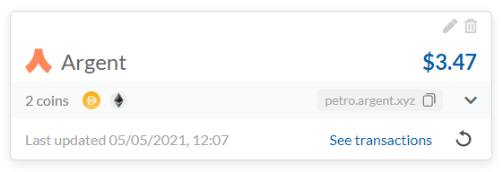

# ACCOINTING.com Interview Challenge

This is the ACCOINTING interview challenge.

## Setup

1. Clone the repository
1. Run `npm install` in `client` and `server` directories
1. Run `npm start` in `client` and `server` directories to start the web app

## Challenge

The point of the challenge is to replicate a wallet box component
and it's refresh functionality. Edit, delete and 'See transactions'
just have to be in place and do nothing


To see how it works:
1. Go to [https://accointing.com](https://accointing.com)
1. Sign in with credentials - email: `interview-challenge@accointing.com` password: `interview-Challenge`
1. Go to Wallets page
1. Click on the refresh button on the bottom right

_Please do not edit/delete the wallet_

## Docs

We provide a mock API for wallets. You can find the code (and the model of the wallet)
in `server/src/common/wallet/wallet.controller.ts`.

GET `/wallet/wallets`:

Returns a mock wallet
```
[{
    id: 1,
    name: 'Daily Trading',
    walletAddress: 'address.argent.xyz',
    totalValue: 999.99,
    balance: {
        BTC: { quantity: 0.009, value: 500 },
        ETH: { quantity: 0.15, value: 500 },
    },
    walletProvider: {
        id: 1,
        name: 'Argent'
    },
    lastUpdated: Date.now(),
}]
```

POST `/wallet/sync-wallet/:id`:
Mocks wallet refresh. Returns a response in 5-10 seconds (random)

Wallet and currency icons are located in `client/src/wallets`
_(feel free to use different icons)_

## Submit

When you're done archive the app in a zip file `git archive --format=zip --output project.zip main`
and submit it to the same email that you got it from